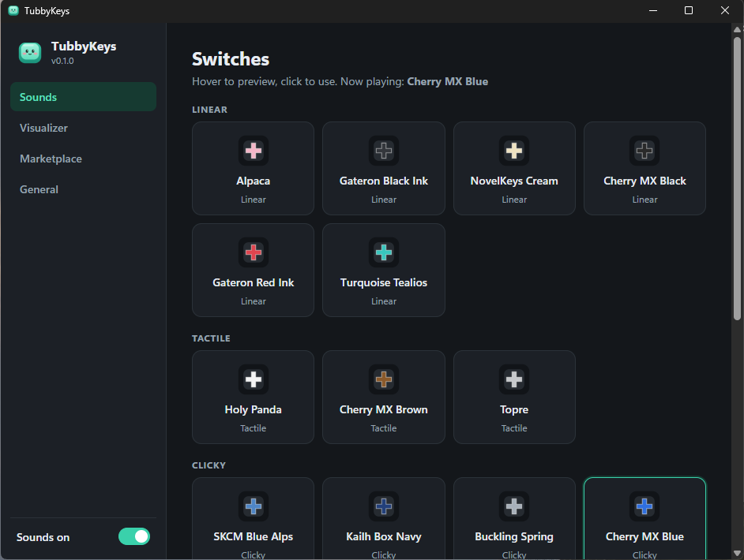

<p align="center">
  
</p>

<h1 align="center">TubbyKeys</h1>

<p align="center">
  Real mechanical keyboard sounds for Windows. Free, open source, and private.
</p>

<p align="center">
  <a href="https://github.com/jherobred/TubbyKeys/releases/latest">Download</a> ·
  <a href="#features">Features</a> ·
  <a href="marketplace/README.md">Sound packs</a> ·
  <a href="CONTRIBUTING.md">Contribute</a>
</p>

<p align="center">
  
</p>

TubbyKeys plays a real switch recording every time you press a key, in any app. Keys on the left sound from the left, keys on the right from the right. It lives in the system tray and stays out of your way.

## Features

- **13 real switches built in:** Holy Panda, NovelKeys Cream, Alpaca, Turquoise Tealios, Gateron Black Ink and Red Ink, Cherry MX Black, Brown and Blue, Kailh Box Navy, Buckling Spring, SKCM Blue Alps and Topre. Each has separate press and release sounds, plus per-row, space, enter and backspace samples.
- **Spatial audio:** stereo panning follows each key's position on the board. The stereo field narrows automatically when the output is headphones.
- **Tone and pitch pad:** drag one point from thock to clack and from deep to sharp.
- **Randomized pitch:** tiny variations so repeated keys never sound robotic.
- **Hover preview:** hover a switch to hear it before you pick it.
- **Tray app:** left-click the tray icon for volume, tone, switches and the visualizer. Right-click for a menu. The icon follows the light or dark taskbar.
- **Visualizer:** an optional click-through overlay with a mini keyboard that ripples and a combo counter. Pop In, Slide, Bounce and Pulse animations. Top, bottom or random placement. The combo can reset after a pause or last forever.
- **Global hotkey:** `Ctrl+Alt+K` toggles sounds from anywhere. You can change it.
- **Marketplace:** download community packs in-app. Every file is checked against a SHA-256 checksum before install.
- **Low overhead:** a lock-free, allocation-free mixer on a real-time audio thread. The output stream pauses after 20 seconds of silence, so it never keeps your PC awake.

## Privacy

- TubbyKeys reads only which physical key moved and whether it went down or up. It never reads, records, stores or sends what you type.
- No accounts, analytics or tracking. Settings are stored in `%APPDATA%\com.tubbykeys.desktop` and packs in `%LOCALAPPDATA%\com.tubbykeys.desktop\packs`.
- The only network access is the Marketplace page, which downloads the catalogue and packs from this repository over HTTPS while it is open.

## Install

Download the installer from [Releases](https://github.com/jherobred/TubbyKeys/releases/latest) and run it. It installs for your user only, with no admin rights needed. Requires Windows 10 or 11 (64-bit).

The installer is not code-signed yet, so Windows SmartScreen may warn you. Choose **More info → Run anyway**, or build it yourself from source.

## Build from source

You need [Rust](https://rustup.rs), [Node.js](https://nodejs.org) 22 or newer, and the [Tauri prerequisites for Windows](https://tauri.app/start/prerequisites/): the MSVC build tools and WebView2, which ships with Windows 11.

```bash
npm install
npm run tauri dev      # run with hot reload
npm run tauri build    # build the installer into src-tauri/target/release/bundle
```

Tests:

```bash
cd src-tauri && cargo test
```

## Sound packs

The marketplace catalogue lives in [`marketplace/`](marketplace/). Anyone can add a pack with a pull request. See the [pack guide](marketplace/README.md) for the format and rules. To try a pack locally, drop its folder into the packs folder (Settings → Marketplace → Open packs folder). It shows up under **Community**.

## Known limitations

- Windows does not let a normal app hear keys typed into windows running as administrator, so those keys are silent unless TubbyKeys also runs as administrator.
- Windows only for now. The audio engine and UI are cross-platform, so the key listener is the main part a macOS or Linux port would need.

## How it works

| Part | Tech |
| --- | --- |
| App shell | [Tauri 2](https://tauri.app) (Rust + WebView2) |
| Key listener | `WH_KEYBOARD_LL` hook on its own thread, scan codes only |
| Audio | [cpal](https://github.com/RustAudio/cpal) (WASAPI), [symphonia](https://github.com/pdeljanov/Symphonia) decoding, lock-free [rtrb](https://github.com/mgeier/rtrb) queues |
| UI | React + TypeScript + Vite |
| Marketplace | Static `index.json` in this repo, downloads verified by SHA-256 |

## Credits

Built-in recordings come from [kbsim](https://github.com/tplai/kbsim) by Thomas Lai (MIT). Marketplace starter packs are CC0 recordings by unicaegames (OpenGameArt) and StavSounds, alpinemesh, yottasounds and Foxfire- (Freesound). See [THIRD_PARTY_NOTICES.md](THIRD_PARTY_NOTICES.md).

TubbyKeys is inspired by Keeby for macOS. It is an independent project and is not affiliated with Keeby.

## License

[MIT](LICENSE)
